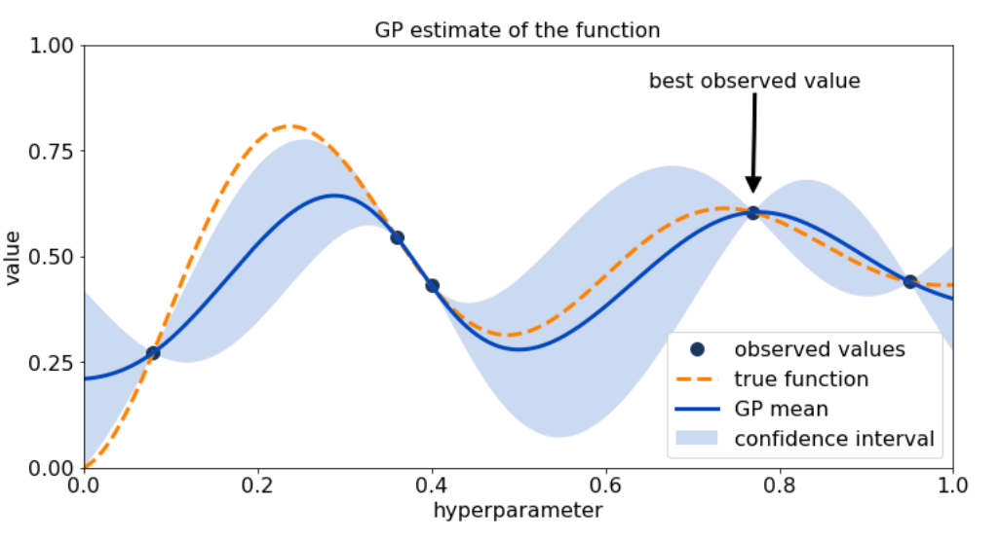

---
jupyter:
  jupytext:
    formats: ipynb,md
    text_representation:
      extension: .md
      format_name: markdown
      format_version: '1.3'
      jupytext_version: 1.10.2
  kernelspec:
    display_name: Python 3
    language: python
    name: python3
---

```python
%load_ext autoreload
%autoreload 2

import math
import numpy as np
import pandas as pd
import matplotlib.pyplot as plt

import GPy
from emukit.model_wrappers import GPyModelWrapper
from emukit.core import ParameterSpace, ContinuousParameter
from emukit.bayesian_optimization.acquisitions import ExpectedImprovement
```

# Bayesian Optimization
<center>

</center>

# Intro

In this notebook Bayesian Optimization is explained by introducing the theory behind it, eloborating on it via an example. This document is intended for people who are working with or are interested in optimizing certain inputs for an output which is expensive to compute. Example use cases are:

* Hyperparamater tuning for models that take a long time to train.
* Optimizing target features by finding the perfect amount of ingredients for lab experiment.

In all of the above examples we're trying to optimize some output values which we get by running an expensive process together with some input variables which we are able to vary. The ultimate question is then: "What are the optimal input settings, so I get the ideal output?"

There are many different methods, algorithms and optimization methods which try to find these optimal input settings as quickly as possible. Reaching the optimal solution quickly, or finding out you will never be able to, is important in these types of problems, because running experiments is costly. Bayesian Optimization is aimed to converge to the optimal solution by using a low number of iterations. 

## Resources

Some of the literature used for this notebook

|                                                                              name                                                                            |           author          |                                                link                                              |
|:------------------------------------------------------------------------------------------------------------------------------------------------------------:|:-------------------------:|:------------------------------------------------------------------------------------------------:|
|                                                             A   Tutorial on Bayesian Optimization                                                            |     Peter   I. Frazier    |                                https://arxiv.org/pdf/1807.02811.pdf                              |
|     A   Tutorial on Bayesian Optimization of Expensive Cost Functions, with   Application to Active User Modeling and Hierarchical Reinforcement Learning    |        Eric   Brochu      |                                https://arxiv.org/pdf/1012.2599.pdf                               |
|                                                Practical   Bayesian Optimization of Machine Learning Algorithms                                              |       Jasper   Snoek      |     https://proceedings.neurips.cc/paper/2012/file/05311655a15b75fab86956663e1819cd-Paper.pdf    |
|Exploring Bayesian Optimization| distill| https://distill.pub/2020/bayesian-optimization/ |

## Prerequisites 

To get a good grasp of this notebook some preliminary knowledge is expected. Please touch up on the subjects below if you're unfamiliar with it, since they will not be explained in this notebook.

* Gaussian Process
* Basic Python
* Basic (Bayesian) Statistics

## Implementation

There are many packages available in the open source community which have implemented Bayesian Optimization. We could write everything from scratch, but of course it's more efficient to not reinvent the wheel and build upon what the open source community provides. What package to use tho? That depends on your use case, some implementations are very easy to understand, have a high level API, but lack customizability. Others are a bit harder to pick up, because of the lower level API, but are more friendly to customize.

For this notebook we're going to use GPy to model our Gaussian Process and EmuKit to run Bayesian Optimization loops. But it's highly recommended to check out the tutorials in the documentation of these packages below to see if they fit your use case. 

|             name            |                               link                              |     stars    |               description         | 
|:---------------------------:|:---------------------------------------------------------------:|:------------:|:---------------------------------:|
|        scikit-optimize      |             https://scikit-optimize.github.io/stable/           |     2.200    | High level api, very easy to set up and plot stuff, but not very customizable. |
|              GPy            |                https://github.com/SheffieldML/GPy               |     1.600    | Very popular package to model gaussian processes, lots of kernels and customizability. |
|            GPFlow           |                 https://github.com/GPflow/GPflow                |     1.500    | Solves scalability issues of GPy (inverting large matrices) by estimating posteriors with  tensorflow. |
|        scipy.optimize       |     https://docs.scipy.org/doc/scipy/reference/optimize.html    |     8.600    | Lots of optimization algorithms, big community, no bayesian optimization. |
|            GPyOpt           |               https://sheffieldml.github.io/GPyOpt/             |      760     | Optimization algorithms like bayesian optimization on GPs, built on GPy. |
|           Spearmint         |                 https://github.com/HIPS/Spearmint               |     1.400    | Bayesian optimization package. |
|     BayesianOptimization    |           https://github.com/fmfn/BayesianOptimization          |     5.400    | Bayesian optimization package. |
|            EmuKit           |                 https://github.com/emukit/emukit                |      353     | Toolkit built on GPy for plotting and optimization. |


# Bayesian Optimization Definition

Let's start with a clear mathematical description. In essences we're trying to optimize an expensive objective function. We do this by building a model for the objective function based on data points we have seen before. This model needs to have a measure of uncertainess. Using the model predictions together with the uncertainess we can compute an acquisition function on our entire domain and find a point in our domain which maximizes the acquisition function. The acquisition function therefore specifies which data point to try next, because the maximum of the function is the point which maximizes the probability of improvement or expected improvement. We then query this next data point for real by running it through our expensive objective function and get the result. We add the result to our data points and refit the models, compute the acquisition function, find the maximum, etc. etc.

You can see it's an iterative process where we try to improve each iteration.

## Objective function

We are interested in solving 

$$x_* = arg_{x\in X}\min f(x)$$

under the contraints that

* $f$ is a black box for which no closed form is known (nor its gradients);
* $f$ is expensive to evaluate;
* and evaluations of $y = f(x)$ may be noisy.

## Bayesian Optimization Loop

For $t=1: T$
1. Given observations $(x_i, y_i = f(x_i))$ for $i=1:t$, build a probabilistic model for the objective $f$. Integrate out all possible true functions, using Gaussian process regression.

2. Optimize a cheap acquisition/utility function $u$ based on the posterior distribution for sampling the next point. $x_{t+1} = arg\min_xu(x)$. Exploit uncertainty to balance exploration against exploitation.

3. Sample the next observation $y_{t+1}$ at $x_{t+1}$

## Acquisition functions

Acquisition functions $u(x)$  specify which sample $x$: should be tried next:

* Expected improvement (default): $-EI(x) = -\mathbb{E}[f(x)-f(x_t^+)]$
* Lower confidence bound: $LCB(x) = \mu_{GP}(x) + k\sigma_{GP}(x)$
* Probability of improvement: $-PI(x) = -P(f(x) \geq f(x_t^+)+k$

where $x_t^+$ is the best point observed so far.

In most cases, acquisition functions provide knobs (e.g., $k$) for controlling the exploration-exploitation trade-off. - Search in regions where $\mu_{GP}(x)$ is high (exploitation) - Probe regions where uncertainty $\sigma_{GP}(x)$ is high (exploration)

# A simple example

Now the above definition sounds pretty complicated, but once you see it in action with some code examples. Things will be much clearer. 

To start we need to have a fake objective function. For this we're going to use the [branin](https://www.sfu.ca/~ssurjano/branin.html) function, which has a two dimensional input space. Since the 1d case will be to easy to implement.

$$f(x) = a(x_2-bx_1^2+cx_1-r)^2+s(1-t)\cos(x_1)+s$$

Where $a=1, b=5.1/(4\pi^2), c=5/\pi, r=6, s=10, t=1/(8\pi)$. It is known that the global minimum lies at $f(x^*)=0.397887$, at $x^*=(-\pi, 12.275), (\pi, 2.275)$ and $(9.42478, 2.475)$. This function is usually evaluated on the square $x_1 \in [-5, 10]$, $x_2 \in [0, 15]$.

```python
%load_ext autoreload
%autoreload 2


import warnings
warnings.filterwarnings('ignore')

import math
import numpy as np
import matplotlib.pyplot as plt

import seaborn as sns
import seaborn as sns; sns.set()
```

```python
def f(x:np.array):
    """
    Branin function
    """
    a = 1
    b = 5.1 / (4 * np.pi**2)
    c = 5 / np.pi
    r = 6
    s = 10
    t = 1 / (8 * np.pi)
    x1 = x[:, 0]
    x2 = x[:, 1]
    y = a * (x2 - b * x1**2 + c * x1 - r)**2 + s * (1 - t) * np.cos(x1) + s
    return y[:, None]
```

```python
def plot_2d_function(func, x1_min, x1_max, x2_min, x2_max):
    """
    func: 2d function which takes input as a list [x1, x2]
    """
    x1 = np.linspace(x1_min, x1_max)
    x2 = np.linspace(x2_min, x2_max)

    X, Y = np.meshgrid(x1, x2)

    A = np.concatenate((X.reshape(1, -1), Y.reshape(1, -1)))
    n_grid_points = A.shape[1]

    z = [func(A[:,i].reshape(1, -1)) for i in range(n_grid_points)]
    z = np.array(z).reshape(int(math.sqrt(n_grid_points)), int(math.sqrt(n_grid_points)))

    fig = plt.figure(figsize=(10,6))
    plt.contourf(X, Y, z, 50, cmap = 'RdGy')
    plt.colorbar()
```

```python
plot_2d_function(f, -5, 10, 0, 15)
```

Now that we have our nice objective function we have to simulate our noise observations!

```python
def noisy_f(x, noise_level=0.5**2):
    """
    Retuns an objective function f with some noise.
    """
    return f(x) + np.random.randn() * noise_level
```

```python
noisy_f(np.array([0,0]).reshape(1, -1))
```

# t=0 The Initialization (Noiseless)

So to start of we need to have some initial data points. You can also start without any initial data points and use a sampling method (e.g. Latin Hypercube Sampling) to pick your initial query points. For this example we're just going to take random initial points. We then fit a Gaussian Process model to these initial data points to try to estimate our objective function. This model will improve the more data points we have. Using the GP and the measure of uncertainess (confidence bound) we can find the point which gives the highest probability of improvement. So using the GP and confidence bound we compute a aquisition function on the domain of $f$ and maximize this aquisition function. We use the point x_* which maximizes our acquisition function as the new query point. We send that query point of to be computed in our real expensive objective function. This will give us a new data point which we use to fit the new Gaussian Process model etc. etc.

```python
n_data_points = 20
rng = np.random.RandomState(5)

start_x1 = rng.uniform(low=-5, high=10, size=n_data_points)
start_x2 = rng.uniform(low=0, high=15, size=n_data_points)
```

```python
X = np.array([[x1, x2] for x1, x2 in list(zip(start_x1, start_x2))])
```

```python
n_data_points = 20
rng = np.random.RandomState(5)

start_x1 = rng.uniform(low=-5, high=10, size=n_data_points)
start_x2 = rng.uniform(low=0, high=15, size=n_data_points)

X = np.array([[x1, x2] for x1, x2 in list(zip(start_x1, start_x2))])
y = np.array([f(x.reshape(1, -1)) for x in X])

plot_2d_function(f, -5, 10, 0, 15)
plt.scatter(start_x1, start_x2, c=y, cmap = 'RdGy', edgecolors="black", vmin=-5, vmax=290);
```

## t=1 Build a probabilistic model 

In this step we're going to build a model for our objective function f, based on the data points we have so far.

```python
# define kernel, notice the number of input dimensions is now 2
ker = GPy.kern.RBF(input_dim=2, ARD=True)

# create simple GP model
m = GPy.models.GPRegression(X,y.reshape(-1, 1),ker)
m.optimize()
_ = m.plot()
```

We see our Gaussian Process already picks up some of the patterns of the Branin function, which is great! The model we use above uses the RBF kernel to compute the covariance between two points. We can pick many other kernels to see which give the best fit, but for this example the RBF is fine. 

We can now use our model to predict never before seen data points. If we call predict on our input data `X` for example we will see that the model will be super accurate and also very certain about it's predictions.

```python
y_pred, y_std = m.predict(X)
print("Mean of the standard deviations of the predictions on X: ", np.mean(y_std))
```

```python
fig = plt.figure(figsize=(10,5))
plt.scatter(y_pred, y)
plt.xlabel("y_pred")
plt.ylabel("y")
plt.title("The gaussian processes has very accurate predictions on points it has already seen.");
```

This is of course to be expected, since the gaussian processes should be very sure of points it has already seen, but once we ask for predictions where we never been close to it will not be so certain anymore. A good plot to look at in this example is the slice where `x_2 = 2.275`, the slice where we know our maximum lies.

```python
_ = m.plot(fixed_inputs=[(1, 2.275)], plot_data=False)
plt.title("Slice of the gaussian process predictions at x_2 = 2.275");
```

Here we can see how the gaussian process works together with the confidence interval. It hasn't discovered our minimum fully yet, but it's on track. We can see that it's uncertain in the region where `x_1 < -5`. That's because it hasn't really seen any data near this slice. It is very certain about `x_1 = -2.5` and `x_1 = 6.4`, that's because it has already seen data very close to it in our data `X`. Points:
```[-2.18418157,  2.82621983], [ 6.48861785,  2.48419292]```


## t=2 Optimize a cheap acquisition

For this section we're going to compute and optimize an acquisition function. We will use emukit in this example to get an acquisition function. It's not that difficult to write it ourselves with the above definition, but emukit has expected improvement implemented and has a nice API. The Expected Improvement acquisition function computes for a given input the improvement over the current best observed value in
expectation.

To get an acquisition function you have to define a domain on where the acquisition is computed. For this example we'll just use the domain of the Branin function. Great!

```python
parameter_space = ParameterSpace([ContinuousParameter('x1', -5, 10), ContinuousParameter('x2', 0, 15)])
model_emukit = GPyModelWrapper(m)
expected_improvement = ExpectedImprovement(model=model_emukit)
```

We can now use this function to evaluate points in our domain. If we will evaluate on points we've already seen before the expected improvement will be incredibly low.

```python
expected_improvement.evaluate(X)[:3]
```

If we try a known maximum: 𝜋, 2.275, then the acquisition function will be a lot higher.

```python
expected_improvement.evaluate(np.array([math.pi, 2.275]).reshape(1, -1))
```

Let's compute the expected improvement on the slice we've seen before. 

```python tags=[]
slice_x1 = np.linspace(-5, 10, 100).reshape(-1, 1)
slice_x2 = np.array([2.275] * 100).reshape(-1, 1)
slice_domain = np.concatenate([slice_x1, slice_x2], axis=1)
slice_ei = expected_improvement.evaluate(slice_domain)
```

```python
_ = m.plot(fixed_inputs=[(1, 2.275)], plot_data=False)
# _ = m.plot(fixed_inputs=[(1, -5)], plot_data=False)
plt.plot(slice_x1, slice_ei, color='red', label='Expected Improvement');
plt.legend();
```

We can see clearly that the expected improvement is higher in regions where our model predictions are lower and the spread somewhat bigger. We can also compute the expected improvement for the entire domain and visualize it!

```python
plot_2d_function(f, -5, 10, 0, 14);
plt.title("Real Branin objective function ")
plot_2d_function(expected_improvement.evaluate, -5, 10, 0, 14)
plt.title("Expected improvement");
```

Here we can see that based on 50 data points our model and acquisition function are quite accurate on finding areas in our domain where our minimum resides. We can see that the x in our domain which maximizes the acquisition function lies around -5, 10.

```python
x1 = np.linspace(-5, 10)
x2 = np.linspace(0, 14)

mesh_X1, mesh_X2 = np.meshgrid(x1, x2)

A = np.concatenate((mesh_X1.reshape(1, -1), mesh_X2.reshape(1, -1)))
n_grid_points = A.shape[1]
argmax = np.argmax(expected_improvement.evaluate(A.T))
x_star = A.T[argmax, :]
y_star_pred = expected_improvement.evaluate(A.T[argmax, :].reshape(1, -1))
print(f"The next query point will be x_star: {x_star}. With expected improvement: {y_star_pred} ")
```

Or using the emukit API:

```python
from emukit.core.optimization import GradientAcquisitionOptimizer

optimizer = GradientAcquisitionOptimizer(parameter_space)
x_new, y_acq = optimizer.optimize(expected_improvement)
```

```python
print(f"The next query point will be x_star: {x_new}. With expected improvement: {y_acq} ")
```

We can also see this in action by looking at the model prediction and uncertainness at the next query point. 

```python
mu, var = m.predict(x_new)
mu = mu.item()
var = var.item()

current_best = np.min(y)

print("mu: ", round(mu, 3), ", var: ", round(var, 3))
print("current best: ", round(current_best, 3))
```

```python
from scipy.stats import norm
x_axis = np.arange(-100, 100, 0.001)
plt.plot(x_axis, norm.pdf(x_axis, mu, math.sqrt(var)))
plt.vlines(current_best, 0, 0.0175, color='grey')
plt.title(f"Gaussian distribution around the model prediction for x_new")
plt.show()
```

## t=3 Sample the next observation

In the last step of a bayesian optimization iteration we sample the query point given by our acquisition function, by actually computing the objective function at x_star. We then get a real observation back which we append to the exisiting data points. We retrain the model, recompute our acquisition function, find the maximum of the acquisition function, sample the query point, etc. etc.

```python
y_new = f(x_new)

y = np.append(y, y_new)
X = np.append(X, x_new, axis=0)

print(f"The new query point sampled at {x_new} returned {y_new}")
```

Ok, so that query point was definitely not very good. But once we feed the new data point to our model, it will have figured out that the area near our last query point will not be that benificial to explore once more. We can of course write out all the steps above in a loop ourselves, but emukit already has a nice API to do this for us.

```python
n_loops = 10

for i in range(n_loops):
    # create GP again on new sampled dataset
    m = GPy.models.GPRegression(X, y.reshape(-1, 1), ker)
    m.optimize()
    model_emukit = GPyModelWrapper(m)

    # Compute acquisition function again, and find max for new query point
    expected_improvement = ExpectedImprovement(model=model_emukit)
    optimizer = GradientAcquisitionOptimizer(parameter_space)
    x_new, y_acq = optimizer.optimize(expected_improvement)
    
    # Sample new query point again
    y_new = f(x_new)
    y = np.append(y, y_new)
    X = np.append(X, x_new, axis=0)
    print(f"The new query point sampled at {x_new} returned {y_new}")
    
print(f"Current best: x = {X[np.argmin(y)]}, y* = {min(y)}")
```

You can also execute the above plots again to see how the expected improvement on the domain changes over time.

```python
print(f"Current best: x = {X[np.argmin(y)]}, y* = {min(y)}")
```

With a known minimum of ~0.39 it got there in very few iterations!

Of course you can do the same with emukit:

```python
from emukit.bayesian_optimization.loops import BayesianOptimizationLoop

bo = BayesianOptimizationLoop(
    space=parameter_space,
    model=model_emukit,
)

bo.run_loop(f, 10)
```

```python
min(bo.loop_state.Y)
```

For now that was all you need to know about a first Bayesian Optimization implementation. There are many more things we could expand upon, but we're going to do that in different notebooks and tutorials. 


## Further Reading and Challenges

Bayesian Optimization is great, but of course it's not your one stop shop for all optimization problems. Here are some of the challenges we faced and possible solutions we explored. In the future we plan to create a notebook tutorial on all of the subjects below. 

### Multiple Query Points
The implementation above only gives you a single query point which you then send of to sample in your very expensive objective function. In practice you might be able to try out multiple query points in parallel. This means in each iteration you will need more than one query point. There are several methods available to solve this is issue, but they mostly revolve around lying to our model. Instead of sending the query point of to be evaluated truly, we pretend we got the result back by lying with either returning a constant, the mean of the target or the exact model prediction.

- Constant Liar Strategy
- Mean Liar Strategy
- Model Liar Strategy

### Discrete Input Space

The implementation above has two input dimensions, which both are continous and have a fixed domain. In reality one of your input dimensions might be a categorical value. A great [paper](https://arxiv.org/pdf/1805.03463.pdf) available on how to deal with these issues. The most popular python packages (e.g. GPy, scikit-learn) have some implementations in their API regarding dealing with categoricals.

### Parameter Tuning

In the example above we used the RBF kernel to compute covariance between two points in our domain. In reality there are many more kernels to choose from which might fit better for your type of problem. Trying out different kernels and checking model performance can be a great addition in improving your bayesian optimization loop.

The gaussian process itself also has some parameters which could be tweaked to improve the speed of convergence to your optimum. The variance being one of the most important factors, because the expected improvement (and lot's of other aquisition functions) use the confidence interval to determine the next best query point. Having a to high (or low) variance parameter can negatively influence your convergence speed.

### Scaling Bayesian Optimization

Since almost all bayesian optimization implementations use a Gaussian Process to model the target variable you always run in to scaling issues when your dataset becomes large. This is because computing gaussian process posteriors analytically involves inverting an N x N matrix where N is the amount of datapoints you have. 

A great python package called [GPflow](https://github.com/GPflow/GPflow) was developed to tackle this problem. This package doesn't compute the posteriors analytically, but uses tensorflow to estimate the gaussian process posterior. GPflow is built upon GPy so the API should feel familiar if you have used GPy before. Unfortunately emukit is not compatible with GPflow so you have to write your optimization logic yourself or use something like [GPflowOpt](https://github.com/GPflow/GPflowOpt).

### Multi objective (target vector)

In the example above we were trying to optimize a single target variable `y`, but in real life most of the time you have multiple objectives (or multiple target variables) you want to optimize for. You can of course create a feature which is sum of all your targets or computes some sort of cost based on your targets and fit a model on that, but that way you loose information regarding the fit of your model on the individual targets. If your model predicts a low or high objective you don't know which individual target feature is responsible for that.

There is a [paper](http://proceedings.mlr.press/v89/uhrenholt19a.html) which tries to solve this, which also comes with it's own [github](https://github.com/akuhren/target_vector_estimation) implementation using GPy and emukit. One can use this implementation to optimize for multiple targets at the same time without losing sight on model interpretability.


```python

```
